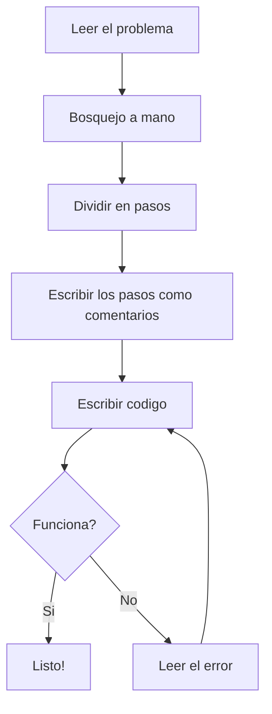

# Estrategias para resolver problemas

Antes de escribir codigo, hay que pensar. Estas estrategias te ayudan a no quedarte atascado frente a un problema.



---

## 1. Lee el problema completo

Parece obvio, pero muchos errores vienen de no leer bien. Lee todo el enunciado antes de tocar el teclado. Si hay un ejemplo, asegurate de entenderlo bien.

---

## 2. Identifica que entra y que sale

Todo programa recibe datos y produce un resultado. Antes de programar, preguntate esto:

- **Que datos me dan?** (numeros, texto, una lista...)
- **Que tengo que mostrar?** (un resultado, un mensaje, una lista ordenada...)

Ejemplo: "Dado un numero, decir si es par o impar."

- Entrada: un numero entero
- Salida: un texto que diga "par" o "impar"

---

## 3. Haz un bosquejo a mano

==Toma papel y lapiz (o piensalo en tu cabeza)== y haz un bosquejo de como resolverias el problema. Prueba con unos valores para ver si tu idea funciona. Si no puedes resolverlo a mano, tampoco vas a poder programarlo.

Ejemplo: "Calcular el promedio de unas notas."

Pruebo con 90, 75 y 88:

- Sumo: 90 + 75 + 88 = 253
- Divido entre 3: 253 / 3 = 84

Pruebo con otros valores, como 100 y 50:

- Sumo: 100 + 50 = 150
- Divido entre 2: 150 / 2 = 75

Funciona. Ahora ya sabes los pasos que tiene que hacer tu programa.

---

## 4. Divide en pasos pequenos

No intentes resolver todo de golpe. Separa el problema en pasos simples y resuelve uno a la vez.

Ejemplo: "Leer 5 notas y mostrar el promedio."

1. Leer las 5 notas
2. Sumarlas
3. Dividir la suma entre 5
4. Mostrar el resultado

Cada paso se convierte en unas pocas lineas de codigo. Un buen truco es escribir esos pasos como comentarios en el codigo antes de programar:

```cpp
#include <iostream>
using namespace std;

int main() {
    // Paso 1: leer las notas
    // Paso 2: sumarlas
    // Paso 3: dividir entre la cantidad
    // Paso 4: mostrar el resultado
    return 0;
}
```

Despues vas llenando cada paso con codigo.

---

## 5. Escribe el codigo paso a paso

Ejecuta frecuentemente para verificar que todo funcione antes de pasar al siguiente paso:

```cpp
#include <iostream>
using namespace std;

int main() {
    // Paso 1: leer las notas
    int notas[] = {90, 75, 88, 62, 95};

    // Paso 2: sumarlas
    int suma = 0;
    for (int i = 0; i < 5; ++i) {
        suma = suma + notas[i];
    }

    // Paso 3 y 4: dividir y mostrar
    cout << "Promedio: " << suma / 5 << "\n";
    return 0;
}
```

---

## 6. Prueba con diferentes datos

No te quedes con un solo ejemplo. Prueba con casos distintos:

- **Caso normal** — datos comunes
- **Caso limite** — el numero mas pequeno o mas grande posible
- **Caso raro** — que pasa si el usuario escribe 0, o un numero negativo?

---

## 7. Si algo no funciona, lee el error

Los errores del compilador parecen complicados pero casi siempre dicen exactamente que esta mal y en que linea. Busca el numero de linea y revisa que hay ahi.

Errores comunes:

| Error | Que suele ser |
| --- | --- |
| `expected ';'` | Te falta un punto y coma |
| `undeclared identifier` | Usaste una variable que no existe o la escribiste mal |
| `no match for operator` | Estas mezclando tipos (por ejemplo texto con numero) |

---

## 8. Resumen

1. Lee todo el problema
2. Identifica entrada y salida
3. Resuelve a mano
4. Divide en pasos pequenos
5. Programa paso a paso
6. Prueba con datos diferentes
7. Lee los errores con calma
